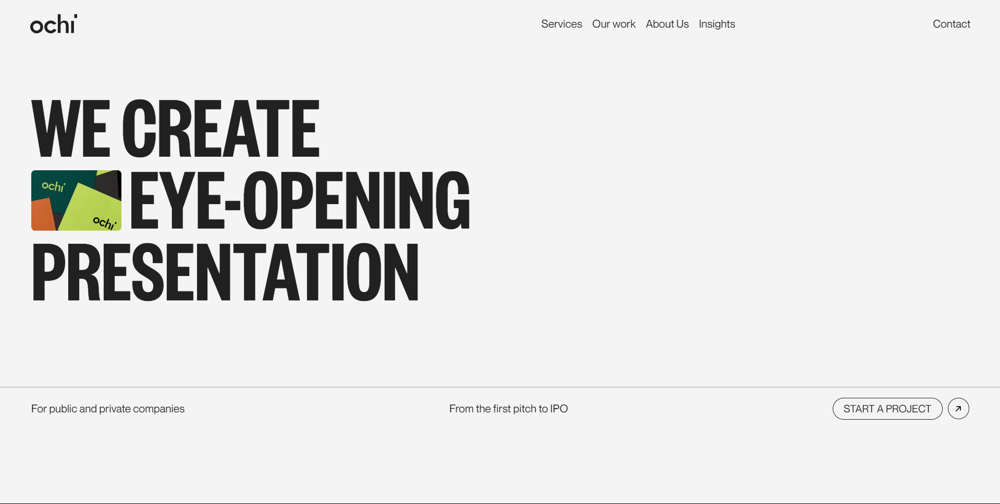
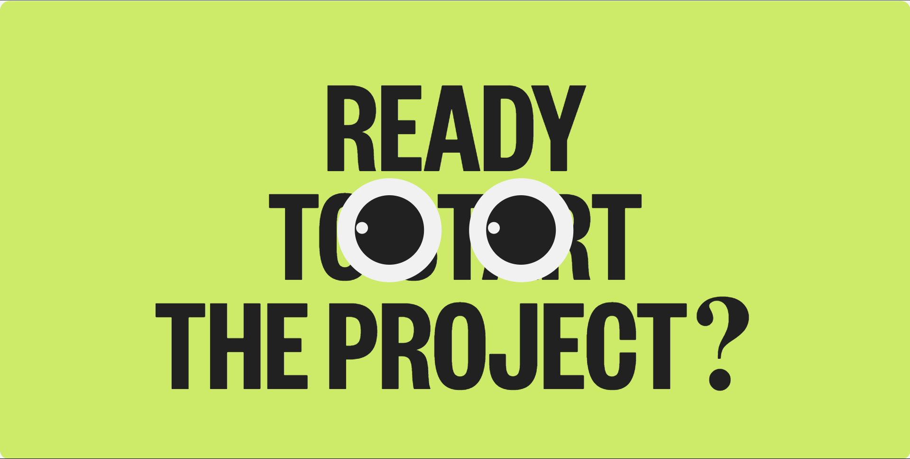

# Ochi

## Overview
Ochi is a ReactJS-powered website developed to understand and explore React fundamentals and modern web animations. Built using Vite for fast development, it integrates multiple animation libraries like Framer Motion, GSAP, and Locomotive Scroll to deliver an engaging and interactive user experience. Each section is thoughtfully animated to bring a sense of dynamism and flow.

Original Website: [Ochi Design](http://ochi.design)

## Table of Contents
- Features
- Technology Stack
- Animation Overview
- Screenshots
- Learnings
- Conclusion

## Features
- **Smooth Scrolling**: Implemented using Locomotive Scroll for a fluid scrolling experience with parallax effects.
- **Custom Navbar Animation**: Navigation bar hides when scrolling down and reappears when scrolling up for intuitive navigation.
- **Modern Animations**: Various animations integrated using Framer Motion and GSAP.
- **Reusable Components**: Built with a modular component structure in React for maintainable code.
- **Optimized Performance**: Fast load times with Vite and efficient animation and resource management.

## Technology Stack
- **ReactJS**: For building the component-based structure.
- **Vite**: Development server and build tool.
- **Framer Motion**: For micro-interactions, hover effects, and component transitions.
- **GSAP (GreenSock Animation Platform)**: For advanced animations and scroll-triggered effects.
- **Locomotive Scroll**: For smooth scrolling and parallax effects.
- **CSS3 (Flexbox/Grid)**: For responsive layout and design.

## Animation Overview
- **Navigation Bar Animation**: Disappears when scrolling down and reappears when scrolling up, controlled by state changes in React.
- **Section Scroll Animations**: Smooth scrolling effects with parallax-like feel using Locomotive Scroll.
- **Framer Motion Animations**: Buttons, links, and hover effects for a polished and dynamic look.
- **GSAP Scroll-Triggered Animations**: Timeline-based animations for elements that come into view while scrolling.

## Screenshots
_screenshots of key sections here. Suggested sections:_
- **Screenshot 1**

- **Screenshot 2**:

## Learnings
- **State and Props**: Managing states for interactions like scrolling and form handling.
- **Component Reusability**: Designing reusable components for scalability and cleaner code.
- **React Hooks**: Using hooks like `useEffect` and `useState` for lifecycle events and user interactions.
- **Animations**: Integrating libraries like Framer Motion, GSAP, and Locomotive Scroll for seamless animations.
- **Performance Impact**: Understanding how animations affect user experience and performance, especially in a single-page application.

## Conclusion
The Ochi website is more than just a project—it's a learning experience that explores the intersection of design, performance, and interactivity. With its responsive layout, smooth animations, and modern design practices, this project showcases the power of React and animation libraries in creating engaging and visually appealing web applications.

## [Oliver Felix](https://instagram.com/oliverfelix.dev)
